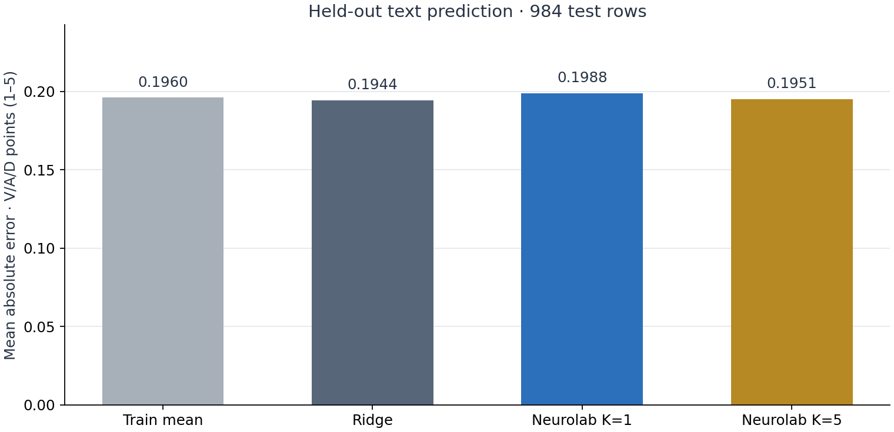
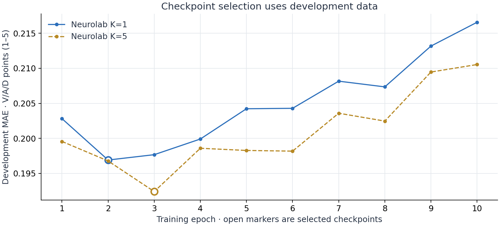
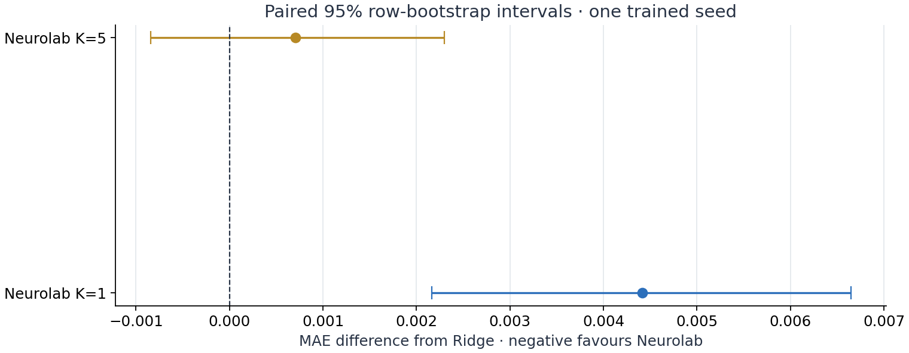

# EmoBank quick run — 2026-10-03

Code revision: `d6f32982a4ffbca6b4955f2680f15136b859bd56`. Source module hashes and package versions are in [report.json](report.json). The Colab source notebook pins this revision.

Configuration: seed 42; 3,000 sampled official train rows; 64 train-fitted lexical features; 10 epochs; independent text memory off; neutral/no affect input. Official dev/test assignments are retained after exact-text overlap exclusions: 985 dev and 984 test rows. Fifteen dev and sixteen test rows were excluded under the declared strip/casefold policy.

| Method | Mean MAE, original 1–5 points |
| --- | ---: |
| Training mean | 0.1960 |
| Ridge | 0.1944 |
| Neurolab K=1 | 0.1988 |
| Neurolab K=5 | 0.1951 |

K=5 has a lower point estimate than K=1 in this configuration. Its MAE difference from Ridge is +0.000703, with a paired 95% row-bootstrap interval of [−0.000844, +0.002301]. This run does not establish superiority over Ridge. The interval covers row resampling at this trained seed, not training-seed variability. Features, regularization and checkpoint selection do not use test labels.

Validation: eight regression checks passed locally and the core revision passed the GitHub workflow. Every Python cell in the [executed notebook](neurolab-executed.ipynb) ran in order through an in-process IPython kernel; three figure outputs are saved. Standard socket-bound Jupyter kernels were unavailable in the execution environment. Direct Google Colab execution remains unverified. Independently recomputed MAE values from saved numeric predictions matched the report; saved model reload preserved predictions. The three rendered figures were inspected for labels, units and clipping.

Source data: JULIELab/EmoBank at `248ce2a43e165a66d31aeaed83cff9641d6654e0`, verified Git blob `e810731bef6967c14daefb84bd904c76628442d7`; CC-BY-SA 4.0, Sven Buechel and Udo Hahn. Raw corpus text is not redistributed here. This is an English lexical-feature experiment and does not reproduce the old transformer-based numerical claims.
